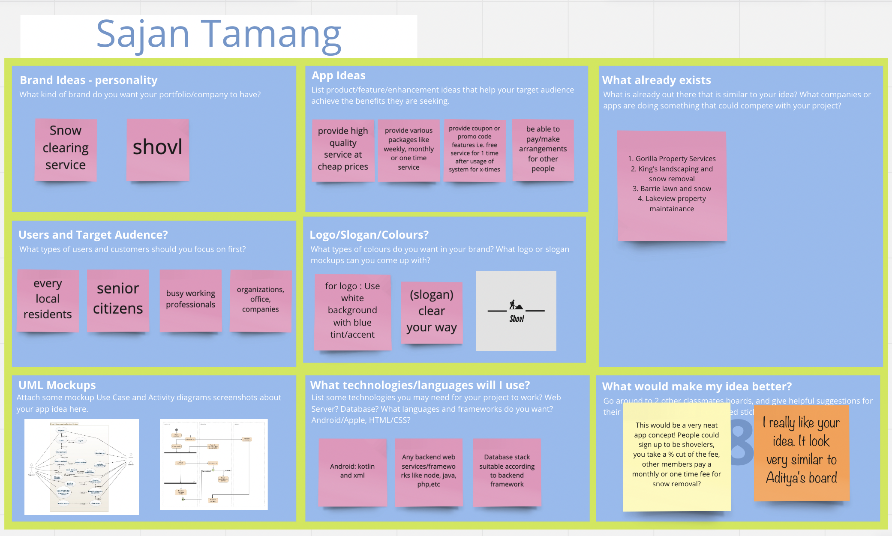
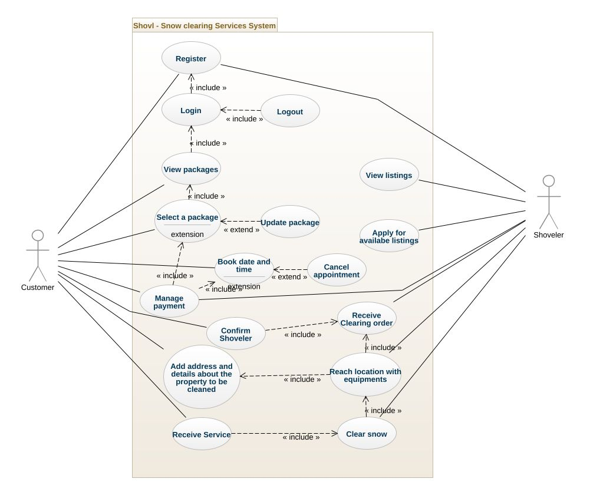
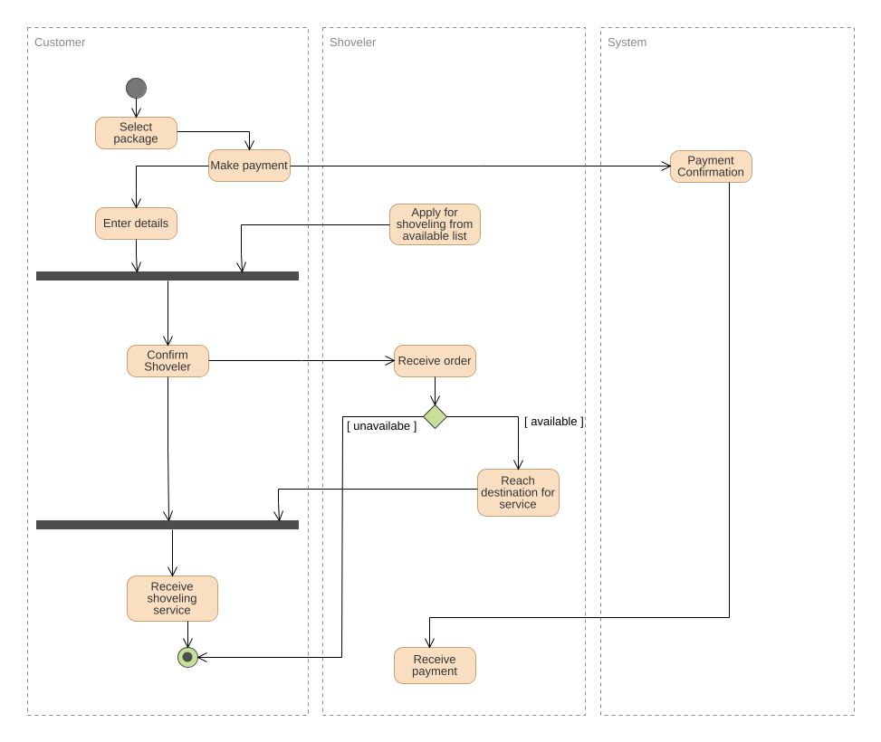

# **shovl**

Shovl is a mobile application that provide snow clearing service. This app only acts as a mediator between actual shoveler and the customer that needs their snow removed from their property.

The brainstorming of the app shows all the app ideas and ways to implement them along with the use case and activity diagram.

# Miro Board - Brainstorm Screen capture

 

## Use Case Diagram

## Activity Diaram

## UI- Wireframes

### 1. Initial page

### 2. Login

### 3. Main page(Dashboard)

### 4. Ad listing page

